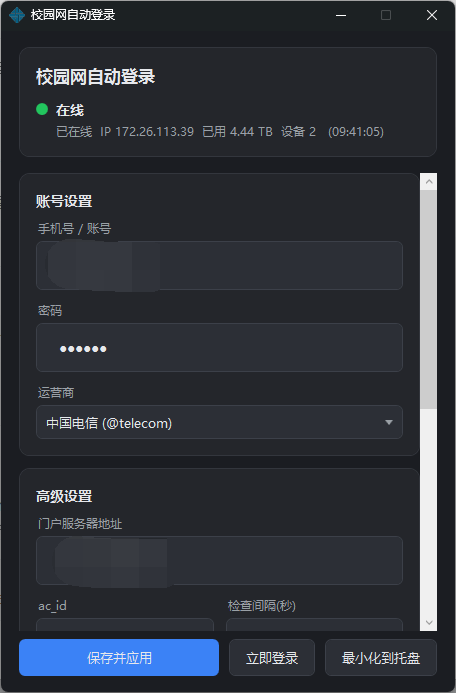

<div align="center">

# 🌐 SrunAutoLogin · 校园网自动登录

**一键登录 + 掉线自动重连的校园网守护工具**
面向深澜（SRUN）门户 · 轻量 · 便携 · 常驻托盘/菜单栏

[](LICENSE)


---

再也不用每次连上 Wi-Fi 都手动打开网页、输手机号密码点登录了。
**填一次账号，之后开机自动登、掉线自动重连**，安安静静待在托盘/菜单栏里。

> ⚠️ 本工具仅用**你自己的账号**、为省去重复手动登录而生。请遵守所在学校的网络使用规定，风险自负。详见 [免责声明](#-免责声明)。

## ✨ 特性

- 🔑 **一键/全自动登录** —— 预存账号密码，点一下或开机即登
- 🛡️ **掉线守护** —— 定时探测在线状态，掉线自动重登（间隔可低至 1 秒）
- 🔒 **密码本地加密** —— Windows 用 DPAPI、macOS 用钥匙串存储；密码全程只以 HMAC 形式上网，**明文不落盘、不外传**
- 🪶 **极致轻量便携** —— 单文件、零依赖、零安装；常驻内存极小
- 🖥️ **常驻后台** —— Windows 托盘 / macOS 菜单栏，状态一眼可见（🟢在线 🟡重连 🔴异常）
- ⚙️ **可配置** —— 运营商、门户地址、检查间隔、开机自启等
- 🌍 **跨平台** —— Windows 与 macOS 双端

| | Windows | macOS |
|---|---|---|
| 技术栈 | WPF · .NET Framework 4.8 | Swift · SwiftUI |
| 形态 | 便携单 exe | 菜单栏 App |
| 运行要求 | Win10/11（系统自带 4.8，**零安装**） | macOS 14+ |

## 📦 下载 / 安装

前往 [**Releases**](https://github.com/kakala666/SrunAutoLogin/releases) 下载对应平台的构建产物；如自行构建，请见下方 [从源码构建](#-从源码构建)。

- **Windows**：下载 `SrunAutoLogin.exe`，双击即用（无需安装）。
- **macOS**：下载 `SrunAutoLogin.dmg`，把 App 拖进「应用程序」。

## 🚀 使用

1. 打开程序，在设置界面填写：**手机号/账号、密码、运营商**（电信/联通/移动）。
2. 按需修改高级项：**门户服务器地址**、`ac_id`、**检查间隔**。
3. 按需开启：**掉线守护、开机自启、启动即最小化**。
4. 点「保存并应用」。之后即可交给它自动运行；也可随时点「立即登录」。
5. 关闭窗口会最小化到托盘/菜单栏；右键图标可「立即登录 / 暂停守护 / 退出」。

## 🖼️ 预览

<div align="center">
  
</div>

## 🛠️ 从源码构建

### Windows

只需 .NET SDK（已验证 9.0.x），**无需** Visual Studio 或 .NET Framework Developer Pack
（net48 引用程序集由 NuGet 包 `Microsoft.NETFramework.ReferenceAssemblies` 提供）。

```powershell
dotnet build -c Release
# 产物：bin\Release\net48\SrunAutoLogin.exe （单文件，可直接拷走）
```

### macOS

```sh
cd Mac
./build.sh          # 产物：build/SrunAutoLogin.app 与 build/SrunAutoLogin.dmg
swift run -- --selftest   # 可选：跑加密算法自检
```

## 🔬 工作原理


1. `GET /cgi-bin/get_challenge` → 取 `token`（挑战值，60 秒有效）与本机 `online_ip`
2. 本地计算登录字段：
   - `password` = `{MD5}` + **HMAC-MD5**(key=token, msg=明文密码)
   - `info` = `{SRBX1}` + 自定义 base64(**XXTEA**(json, token))；json 键序固定为
     `username, password, ip, acid, enc_ver`（`enc_ver=srun_bx1`）
   - `chksum` = **SHA1**(token+username+token+hmd5+token+ac_id+token+ip+token+n+token+type+token+info)
   - 常量 `n=200`、`type=1`
3. `GET /cgi-bin/srun_portal?action=login&...` 提交，返回 `error=="ok"` 即成功
4. `GET /cgi-bin/rad_user_info` → 查询在线状态（`not_online_error` = 掉线）

## ❓ 常见问题

<details>
<summary>登录一直失败怎么办？</summary>

先确认账号、密码、**运营商后缀**、**门户服务器地址**是否正确（不同学校门户地址不同）。
连续失败 3 次会自动暂停，避免频繁请求；修正后点「立即登录」或重新「保存并应用」即可恢复。
查看程序内「运行日志」可看到门户返回的具体错误。
</details>

## 📁 项目结构

<details>
<summary>展开目录结构</summary>

```
SrunAutoLogin/
├─ Crypto/SrunCrypto.cs      HMAC-MD5 / SHA1 / XXTEA / 自定义 base64（已验证）
├─ Core/SrunClient.cs        get_challenge → 登录 / rad_user_info / 字典自愈
├─ Core/Watchdog.cs          定时轮询 + 掉线自动重登（连续失败自动暂停）
├─ Config/AppConfig.cs       配置持久化 + DPAPI 密码加密（零依赖 JSON）
├─ Services/                 日志 / 托盘图标 / 开机自启 / DWM 深色标题栏与工作集回收
├─ Themes/Dark.xaml          现代深色样式
├─ App.xaml(.cs)             托盘、守护、生命周期
├─ MainWindow.xaml(.cs)      配置界面
└─ Mac/                      macOS（Swift/SwiftUI 菜单栏版，行为一致）
   └─ Sources/SrunAutoLogin/ SrunCrypto / SrunClient / AppConfig / AppModel / SrunApp
```

</details>

## 🤝 贡献

欢迎 Issue 与 PR：适配更多学校门户、UI 改进、Bug 反馈都很欢迎。

## ⚠️ 免责声明

本工具仅用于**使用者本人合法持有的校园网账号**、以省去重复手动登录为目的，不含任何破解、绕过计费或未授权访问功能。
请遵守所在学校及网络运营方的相关规定；因使用本工具产生的任何后果由使用者自行承担，作者不承担责任。

## 📄 许可证

基于 [MIT](LICENSE) 开源。你可以自由使用、修改、二次分发，仅需在分发时保留版权与许可声明。
